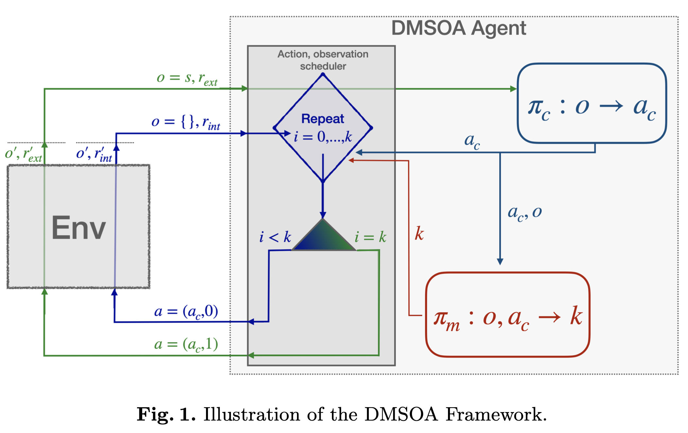
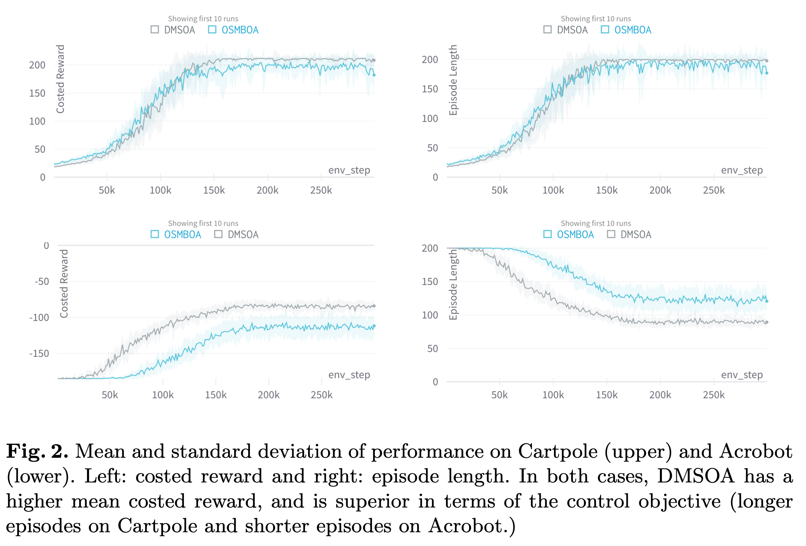

# Dynamic Observation Policies in Observation Cost-Sensitive Reinforcement Learning
This repository includes the code associated with workshop papers presented at NeurIPS 2023 [WANT](https://want-ai-hpc.github.io) and ECML-PKDD 2023 [SCEFA](https://scefa.wp.imt.fr). See the manuscript [here](https://arxiv.org/pdf/2307.02620.pdf).

# Citation

@article{bellinger2023dynamic,
  title={Dynamic Observation Policies in Observation Cost-Sensitive Reinforcement Learning},
  author={Bellinger, Colin and Crowley, Mark and Tamblyn, Isaac},
  journal={arXiv preprint arXiv:2307.02620},
  year={2023}
}

## Background:

The action-perception cycle in RL generally assumes that a measurement of the state of the environment is available at each time step without a cost nor a delay. In applications such as materials design, deep-sea and planetary robot exploration and medicine, however, there can be a high cost associated with measuring, or even approximating, the state of the environment. As a result, the practicality of standard RL methods is limited within settings where observations have high monetary, societal or temporal costs. This work builds on the active measure RL framwork proposed in [1] and the formalization of the active measure RL setting proposed in [2] as an action-contingent, noiselessly observable Markov decision process (AC-NOMDP).

## Hypothesis: 

In order to improve the usefulness of RL in environments with high state measurement costs, the agent ought to have the ability to learn a control policy and a state measurement (overservation) policy. With these tools, the agent can learn to balance its need for timely information with the cost of information. For example, in applications with very high observation cost, the agent can learn to accept more noise and longer trajectories to the goal in order to reduce its observation costs. 

## Methodology: 

Within this context, we propose the Deep Dynamic Multi-Step Observationless Agent (DMSOA). As shown below, the agent learns a control policy $\pi_c: o \rightarrow a_c$ that maps observations to control actions, such as move left or increase torque, and an observation policy $\pi_m: o, a_c \rightarrow k$,  $k \in {1,2,3,...,K}$, that maps the current observation and selected control action to the number of times to repeatedly apply $a_c$. The control action $a_c$ is applied $k-1$ times in the environment without measuring the state of the environment. After the $k^{th}$ application, the state is measured and returned to the agent with the reward $r = (k-1) \times \text{intReward} + \text{extReward}$, where the $\text{intReward}$ is a small positive intrinsic reward for taking a step without measuring, and $\text{extReward}$ is the extrinsic control reward for applying $a_c$ and transitioning into the final (measured) state. Note, extrinsic rewards are not provided for intermediate transitions $(1,...,k-1).

We compare DMSOA with one-step memory-based observationless agent (OSMBOA) [3], which was recently shown to produce good reductions in observations costs. We evaluate the methods on 3 Open AI classic control problems (Cartpole, Acrobot, and Lunar Lander). These have unique dynamics and control policy reward structures that have interesting and unique implications on the agent's learned cost reduction observation policy. In addition, we evaluate the methods on the image-based Atari Pong environment. 

We evaluate the agents in terms of the accumulated extrinsic control reward, the number of times they achieve the control objective during training (e.g. safely landing the lunar lander) and by the reduction in the number of observations and decision steps. The results are averaged over 20 runs with unique seeds. 

## Experiments: 

Our results, show that DMSOA learns a better policy with fewer decision steps and measurements than the considered alternative from the literature. 

As an example, the figure below shows the mean and standard deviation of the reward and episode length for each agent on the Cartpole and Acrobot environments during training. DMSOA achives more reward in both cases. It achieves the maximum episode length for Cartpole (longer is better) and a shorter episode length for Acrobot (shorter is better). In addition, DMSOA has a lower standard deviation across runs. 

In addition to saving due to the reduction on state measurements, DMSOA produces savings in terms of the number action inferences per episodes during application. In all cases, DMSOA has fewer action inferences (decision steps) per episode. 

Clips of the agents playing can be seen [here](https://www.youtube.com/playlist?list=PLr6sWY5moZhFtTuCBbIjb4cZQOZkbjkOV).

## Reproducibility: 

To rerun the experiments:

Create conda environment named `amrl_scefa2023` and install dependencies:

    sh conda/create_cpu_env.sh    

Activate the environment:

    conda activate amrl_scefa2023

Install ptan package needed for the RL models:

    pip install ptan
    
    pip install pygame

Running sweeps (collection of experiments)

We use WandB to run a collection of experiments all at once:

    wandb sweep -e cbellinger sweep_config/[sweepname].yaml

Then run the command output by the above, e.g.:

    wandb agent cbellinger/[proj-name]/[id]

Where [proj-name] and [id] are provided.

## Contact:

Please email c.bellinger@dal.ca with questions and comments. 

## References:

[1] Bellinger C, Coles R, Crowley M, Tamblyn I. Active Measure Reinforcement Learning for Observation Cost Minimization. In Proceedings of the 34th Canadian Conference on Artificial Intelligence. CAIAC 2021.

[2] Nam HA, Fleming S, Brunskill E. Reinforcement learning with state observation costs in action-contingent noiselessly observable markov decision processes. Advances in Neural Information Processing Systems. 2021

[3] Bellinger C, Drozdyuk A, Crowley M, Tamblyn I. Balancing information with observation costs in deep reinforcement learning. In Proceedings of the 35th Canadian Conference on Artificial Intelligence. CAIAC 2022.
